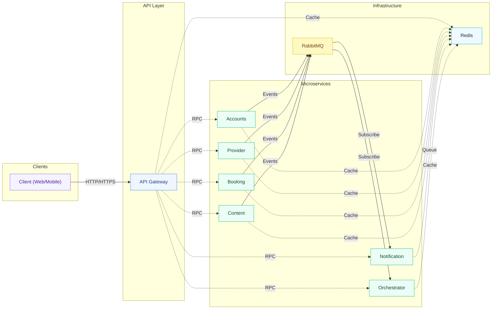

# MedicaLink Microservices

A comprehensive microservices-based medical appointment booking system built
with NestJS, Prisma, PostgreSQL, RabbitMQ, and Redis.

## Architecture Overview

MedicaLink implements a distributed microservices architecture with 7
independent services communicating via RabbitMQ message broker. The system uses
a single PostgreSQL database with schema separation to reduce operational costs
while maintaining clear service boundaries.

### Core Services

1. **API Gateway** - HTTP/REST entry point (Backend for Frontend pattern)
2. **Accounts Service** - Authentication, JWT tokens, staff accounts, RBAC
   permissions
3. **Provider Directory Service** - Doctor profiles, specialties, work
   locations, schedules
4. **Booking Service** - Appointments, patients, scheduling events
5. **Content Service** - Blogs, Q&A platform, doctor reviews
6. **Notification Service** - Email/.. with queue management
7. **Orchestrator Service** - Saga orchestration, read composition,
   cross-service coordination

### Key Architectural Patterns

**Communication Flow:**

- Client requests → API Gateway (HTTP/REST on port 3000)
- API Gateway → Microservices (RPC over RabbitMQ)
- Service-to-Service → Orchestrator Service (event-driven, no direct calls)

**Design Principles:**

- All microservices (except API Gateway) run as RabbitMQ consumers only with no
  HTTP server
- No direct service-to-service communication; all coordination via Orchestrator
- Event-driven architecture using RabbitMQ topic exchange
- Redis caching for frequently accessed data (permissions, schedules)
- Single PostgreSQL database with schema-level separation

## Technology Stack

- **Framework**: NestJS
- **Language**: TypeScript
- **Database**: PostgreSQL with schema separation
- **ORM**: Prisma
- **Message Broker**: RabbitMQ (AMQP)
- **Cache & Queue**: Redis
- **Authentication**: JWT with refresh tokens
- **Email Templates**: MJML + Handlebars
- **Package Manager**: pnpm
- **Deployment**: Docker & Docker Compose

## Project Structure

```
medicalink-microservice/
├── apps/
│   ├── api-gateway/                 # HTTP entry point (port 3000)
│   ├── accounts-service/            # Auth & staff management
│   ├── provider-directory-service/  # Doctors, specialties, locations
│   ├── booking-service/             # Appointments & patients
│   ├── content-service/             # Blogs, Q&A, reviews
│   ├── notification-service/        # Email/SMS notifications
│   └── orchestrator-service/        # Saga & read composition
├── libs/
│   ├── contracts/                   # Shared DTOs, guards, decorators
│   ├── domain-errors/               # Standardized error types
│   ├── error-adapters/              # Error transformation (HTTP/RPC)
│   ├── rabbitmq/                    # Message broker config
│   ├── redis/                       # Cache & queue utilities
│   ├── repositories/                # Base repository pattern
│   └── commons/                     # Shared utilities
├── docs/                            # Documentation
├── deployment/                      # Production deployment configs
├── development/                     # Local development setup
└── scripts/                         # Database seed scripts
```

## Getting Started

### Prerequisites

- Node.js 18+
- pnpm (package manager)
- Docker & Docker Compose
- PostgreSQL, Redis, RabbitMQ (via Docker or standalone)

### Local Development Setup

1. **Clone the repository**

   ```bash
   git clone <repository-url>
   cd medicalink-microservice
   ```

2. **Install dependencies**

   ```bash
   pnpm install
   ```

3. **Configure environment variables**

   ```bash
   cp .env.example .env
   ```

   Edit `.env` with your database credentials and infrastructure URLs.

4. **Start infrastructure services**

   ```bash
   docker-compose -f development/docker-compose.yml up -d postgres redis rabbitmq
   ```

5. **Generate Prisma clients and push schemas**

   ```bash
   pnpm run prisma:generate
   pnpm run prisma:push
   ```

6. **Seed initial data**
   ```bash
   pnpm script -- --service=accounts-service --filename=create-super-admin
   pnpm script -- --service=accounts-service --filename=permission-seeds
   ```

### Running Services

**Start all services concurrently:**

```bash
pnpm run dev
```

**Start individual services:**

```bash
pnpm run start:gateway       # API Gateway
pnpm run start:accounts      # Accounts Service
pnpm run start:provider      # Provider Directory Service
pnpm run start:booking       # Booking Service
pnpm run start:content       # Content Service
pnpm run start:notification  # Notification Service
pnpm run start:orchestrator  # Orchestrator Service
```

**Build services:**

```bash
pnpm run build               # Build all services
pnpm run build:gateway       # Build individual service
pnpm run build:accounts
pnpm run build:provider
pnpm run build:booking
pnpm run build:content
pnpm run build:notification
pnpm run build:orchestrator
```

## Database Architecture

The system uses a single PostgreSQL database with schema separation for cost
efficiency while maintaining logical boundaries:

- **accounts schema** - Staff accounts, permissions, groups, auth versions
- **provider schema** - Doctors, specialties, work locations, schedules
- **booking schema** - Appointments, patients, scheduling events
- **content schema** - Blogs, blog categories, questions, answers, reviews
- **notification schema** - Email templates, email deliveries

### Prisma Commands

```bash
# Generate Prisma clients for all services
pnpm run prisma:generate

# Generate for specific service
pnpm run prisma:generate:accounts
pnpm run prisma:generate:provider
pnpm run prisma:generate:booking
pnpm run prisma:generate:content
pnpm run prisma:generate:notification

# Push schema changes to database
pnpm run prisma:push
```

## Service Communication

### Message Patterns

**RPC Patterns (Request/Response):**

- Format: `domain.action` (e.g., `auth.login`, `appointments.create`)
- Timeout: 10 seconds
- Transport: RabbitMQ direct exchange

**Event Patterns (Pub/Sub):**

- Format: `domain.event` (e.g., `user.created`, `appointment.booked`)
- Transport: RabbitMQ topic exchange (`medicalink.topic`)
- Routing keys with dot notation for flexible subscriptions

**Queue Configuration:**

- Durable queues with message persistence
- TTL: 60 seconds for RPC, 300 seconds for events
- Prefetch count: 1 message at a time
- Dead letter exchange for failed messages

### API Gateway Endpoints

All HTTP endpoints are prefixed with `/api` and exposed on port 3000
(configurable via `API_GATEWAY_PORT`).

**Authentication:**

- `POST /api/auth/login` - Staff login
- `POST /api/auth/refresh` - Refresh access token
- `GET /api/auth/profile` - Get current user profile
- `POST /api/auth/change-password` - Change password
- `POST /api/auth/verify-password` - Verify current password
- `POST /api/auth/password-reset/request` - Request password reset
- `POST /api/auth/password-reset/verify-code` - Verify reset code
- `POST /api/auth/password-reset/confirm` - Confirm password reset

**Doctors & Providers:**

- `GET /api/doctors` - List doctors (public)
- `GET /api/doctors/stats` - Doctor statistics
- `GET /api/doctors/:id` - Get doctor details
- `POST /api/doctors` - Create doctor profile
- `PATCH /api/doctors/:id` - Update doctor profile
- `DELETE /api/doctors/:id` - Remove doctor

**Specialties:**

- `GET /api/specialties` - List specialties (public)
- `GET /api/specialties/:slug` - Get specialty by slug
- `GET /api/specialties/:id` - Get specialty by ID

**Work Locations:**

- `GET /api/work-locations` - List work locations (public)
- `POST /api/work-locations` - Create work location
- `PATCH /api/work-locations/:id` - Update work location
- `DELETE /api/work-locations/:id` - Remove work location

**Appointments:**

- `GET /api/appointments` - List appointments
- `POST /api/appointments` - Create appointment
- `PATCH /api/appointments/:id` - Update appointment
- `DELETE /api/appointments/:id` - Cancel appointment

**Patients:**

- `GET /api/patients` - List patients
- `POST /api/patients` - Create patient
- `PATCH /api/patients/:id` - Update patient
- `DELETE /api/patients/:id` - Remove patient

**Content - Blogs:**

- `GET /api/blogs` - List blogs (public)
- `GET /api/blogs/:id` - Get blog details (public)
- `POST /api/blogs` - Create blog (doctor only)
- `PATCH /api/blogs/:id` - Update blog (admin only)
- `DELETE /api/blogs/:id` - Delete blog (admin only)
- `GET /api/blogs/categories` - List blog categories (public)
- `POST /api/blogs/categories` - Create category (admin only)

**Content - Questions & Answers:**

- `GET /api/questions` - List questions (public)
- `POST /api/questions` - Create question (public, rate-limited)
- `GET /api/questions/:id` - Get question details (public)
- `POST /api/questions/:id/answers` - Create answer (doctor only)
- `POST /api/answers/:id/accept` - Accept answer (admin only)

**Content - Reviews:**

- `GET /api/reviews` - List reviews (public)
- `POST /api/reviews` - Create review (public, rate-limited)
- `GET /api/reviews/doctors/:doctorId` - Get doctor reviews
- `DELETE /api/reviews/:id` - Delete review (admin only)

**Permissions:**

- `GET /api/permissions/users/:id/permissions` - Get user permissions
- `POST /api/permissions/users/:id/permissions` - Assign permission to user
- `DELETE /api/permissions/users/:id/permissions/:permissionId` - Revoke
  permission
- `GET /api/permissions/check` - Check if user has permission

**Health:**

- `GET /health` - Gateway health check
- `GET /api/health` - Service health status

## Permission System

The system implements Role-Based Access Control (RBAC) with resource-action
permissions:

**Roles:**

- `SUPER_ADMIN` - Full system access
- `ADMIN` - Administrative access
- `DOCTOR` - Doctor-specific features

**Permission Format:**

- Resource: `appointments`, `doctors`, `patients`, etc.
- Action: `read`, `write`, `delete`
- Example: `appointments:read`, `doctors:write`

**Usage in Controllers:**

```typescript
@RequirePermission('appointments', 'read')
@RequireDoctorPermission('doctors', 'write')
@Public() // For public endpoints
```

Permissions are cached in Redis for performance and checked via
`PermissionGuard`.

## Development Workflow

### Code Quality

```bash
pnpm run format              # Format code with Prettier
pnpm run format:check        # Check formatting
pnpm run lint                # ESLint with auto-fix
pnpm run typecheck           # TypeScript type checking
```

### Testing

```bash
pnpm test                    # Run unit tests
pnpm test:watch              # Watch mode
pnpm test:cov                # Coverage report
pnpm test:e2e                # End-to-end tests
```

### Running Scripts

```bash
pnpm script -- --service=SERVICE_NAME --filename=SCRIPT_NAME
```

Available scripts:

- `create-super-admin` - Create initial super admin account
- `permission-seeds` - Seed permission data
- `clear-permissions` - Clear all permissions

## Docker Support

### Development Environment

```bash
# Start infrastructure (PostgreSQL, Redis, RabbitMQ)
docker-compose -f development/docker-compose.yml up -d

# Stop infrastructure
docker-compose -f development/docker-compose.yml down

# View logs
docker-compose -f development/docker-compose.yml logs -f
```

### Production Deployment

See `.cursor/DEPLOYMENT.md` for complete production deployment instructions on
Google Cloud Platform.

Quick deployment commands:

```bash
./deployment/deploy.sh start all       # Start all services
./deployment/deploy.sh stop all        # Stop all services
./deployment/deploy.sh restart all     # Restart all services
./deployment/deploy.sh logs all        # View logs
./deployment/deploy.sh update all      # Update and rebuild
./deployment/deploy.sh status all      # Check status
```

## Configuration

Key environment variables (see `.env.example` for complete list):

**Database:**

- `ACCOUNTS_DATABASE_URL` - Accounts service database connection
- `PROVIDER_DATABASE_URL` - Provider service database connection
- `BOOKING_DATABASE_URL` - Booking service database connection
- `CONTENT_DATABASE_URL` - Content service database connection
- `NOTIFICATION_DATABASE_URL` - Notification service database connection

**Infrastructure:**

- `RABBITMQ_URL` - RabbitMQ connection URL
- `REDIS_HOST`, `REDIS_PORT` - Redis connection
- `REDIS_URL` - Alternative Redis connection string

**Application:**

- `API_GATEWAY_PORT` - API Gateway port (default: 3000)
- `SERVICE_NAME` - Service name for Redis key prefixing
- `JWT_ACCESS_SECRET` - JWT access token secret
- `JWT_REFRESH_SECRET` - JWT refresh token secret
- `JWT_EXPIRES_IN` - Access token expiration (seconds)
- `JWT_REFRESH_EXPIRES_IN` - Refresh token expiration (seconds)

**Email (SMTP):**

- `SMTP_HOST` - SMTP server host
- `SMTP_PORT` - SMTP server port
- `SMTP_USER` - SMTP username
- `SMTP_PASS` - SMTP password

## System Diagram



## Contributing

1. Fork the repository
2. Create a feature branch (`git checkout -b feature/your-feature`)
3. Commit your changes following conventional commits
4. Push to the branch (`git push origin feature/your-feature`)
5. Create a Pull Request

### Commit Message Convention

Follow conventional commits specification:

- `feat:` - New feature
- `fix:` - Bug fix
- `chore:` - Maintenance tasks
- `docs:` - Documentation changes
- `refactor:` - Code refactoring
- `test:` - Test changes

## License

This project is licensed under the MIT License.

## Support

For support and questions:

- Create an issue in the repository
- Check the documentation in `docs/`
- Contact the development team
